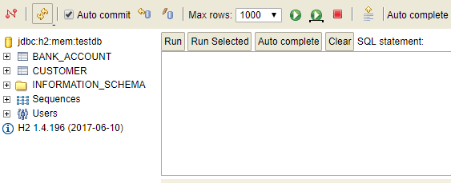

# Security Vulnerability Demo

The purpose of this application is to illustrate a few common security vulnerabilities in web applications. Understanding how these exploits work is critical in being able to defend against them. 

## Application Setup

This application runs in two different modes: 
* Secure - proper protections and being used to mitigate the attacks
* Insecure - the application is exposed to attacks

To run it in either mode, use the spring profile field when starting the app as follows:

Insecure

`mvn spring-boot:run -Dspring.profiles.active=insecure`
Use a browser to access `http://localhost:8080`

Secure

`mvn spring-boot:run -Dspring.profiles.active=secure`
User a browser to access `http://localhost:8081`

In secure mode, you also have the option to enable or disable input validation using the following flag in `application-secure.properties`

`input.validation.enabled=false`

Disabling input validation will allow you to illustrate the power of an ORM and output encoding in protecting against attacks even when input validation does not occur.

Currently, the application illustrates the following vulnerabilities
* SQL Injection
* Stored Cross-Site Scripting (XSS)
* Insecure Direct Object Reference
* Cross-Site Request Forgery 

To use the application, you can log in as an employee or a customer after clicking on either the Employee Portal or Customer Portal link. For simplicity, no password is needed to log in.

| Username | Role | 
| --- | --- |
| emp | Employee |
| liz | Customer |
| katie | Customer |

To view the in-memory H2 database, click the H2 Database Console link and login using the JDBC URL `jdbc:h2:mem:testdb` and the username `user` with a blank password. From there, you should be able to see the console (pictured below) which will allow you to run SQL queries on the database.

## SQL Injection

To exploit this vulnerability, log in as a customer and inject SQL into the first name field as follows

`'; SQL Here; --`

For example:

`'; DROP TABLE customer; --`

`'; UPDATE bank_account SET balance=999999999 WHERE customer_id=2; --`

`Liz' where customer_id=2; UPDATE bank_account SET balance=0 WHERE account_id=1; UPDATE bank_account SET balance=900000000 where account_id=4; --`

You may view the database by logging into the H2 console by clicking the link from the index page. The connection details are found in the application.properties file.

Defending against this vulnerability can be done at multiple levels
* ORM
* Input validation
* Database permissions restrictions

## Cross-Site Scripting

To exploit this vulnerability, log in as a customer and inject the following javascript into the first name field as follows

``

This attack will allow a malicious user to inject a script into the database that then will run on the employee level and expose customer details to another endpoint controlled by the malicious user. In this case, it is simply the same app server, but this would be different in a real attack.

Defending against this vulnerability can be done at multiple levels
* Validating user input 
* Encoding dynamic output on web pages

## Insecure Direct Object Reference

To exploit this vulnerability, log in as a customer and type in the following url which will allow you to access sensitive employee-only information directly.

`/sensitive`

This attack allows users to access information that they should not be authorized to access. 

Defending against this vulnerability can be done through multiple authorization mechanisms
* URL-level protection
* Method-level security with role-based access configuration
* Method pre-authorization configuration

## Cross-Site Request Forgery

To exploit this vulnerability, log in as an employee and then open the `csrf-example.html` in your browser which simulates an attacker's website. For the insecure mode, click the `Insecure CSRF` button and notice that account 1 for customer Katie Fake has been removed from the system. For secure mode, click the `Secure CSRF` and notice that the request is not processed by the system and the Forbidden Resource page is displayed. 

The CSRF attack will allow a malicious user to craft links/forms that can be sent over email or posted to forums that take advantage of the fact that a user may be already authenticated and authorized to perform actions on the targeted site. In this case, it closes an account that still has a balance.

Defending against this vulnerability can be done through multiple mechanisms
* Use random CSRF tokens that are automatically generated and must be supplied in order to perform a state-changing operation during a POST request. Notice the hidden input in the secure mode of the application with attribute `name="_csrf"`
* Check the refferer header in the client's HTTP request